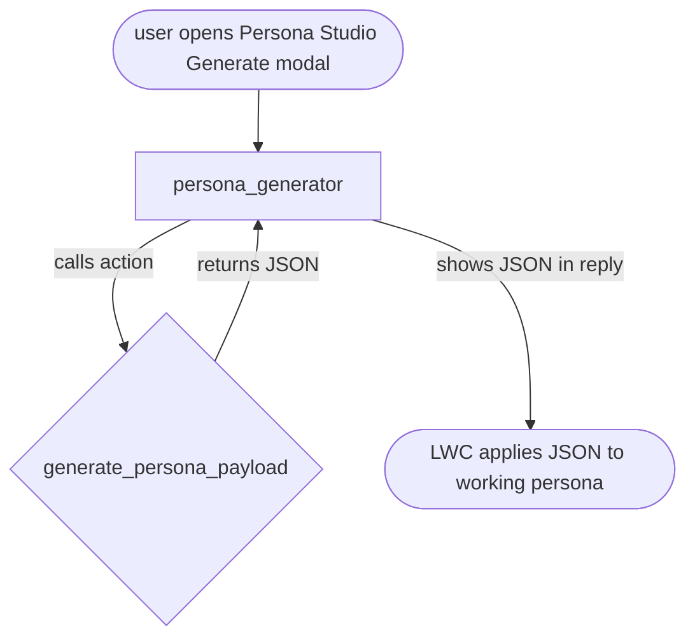

# Demo Studio Persona Agent — Agent Spec

## 1. Purpose & Scope

An Agentforce Employee Agent embedded inside **Persona Studio** that helps SEs and demo builders create a fully-formed **Demo Persona** through natural conversation instead of a form.

The SE describes a story ("I need a persona for a small business owner applying for a line of credit at Cumulus Bank"), the agent asks 1–2 clarifying questions if needed (industry? engagement level? cross-sell target?), then calls an action that returns the full persona JSON — persona fields, identities, insights, activities, journeys, and a component recipe. The SE reviews inline in Persona Studio and hits Save.

**In scope:**
- Understand a natural-language persona brief
- Ask focused clarifying questions when the brief is ambiguous
- Call a single Apex action that generates a Demo Persona JSON payload
- Return the JSON back to the calling LWC via the conversation

**Out of scope:**
- Saving the persona to the database (Persona Studio handles that)
- Multi-persona batch generation
- Editing existing personas
- Theme creation (Themes are separate)

## 2. Behavioral Intent

- **Conversational, not form-like.** The SE describes what they want; the agent asks a small number of questions to disambiguate, not 15.
- **Anchored to the schema.** The generated persona always matches the `Demo_Persona__c` field contract (Brand, Title, Company, LTV, Propensity, Engagement Score, Risk Tier, Suggested Opener, Intent Summary, Key Context, plus children: identities, insights, activities, journeys) and a valid `Component_Recipe__c` JSON string.
- **Story-driven recipe selection.** The recipe (which LWCs to render) should reflect the story. Cross-sell → include CrossSellInsights. Email engagement → include LikelihoodScoreCard. Journey orchestration → include ActiveJourneyTracker.
- **Fast.** The whole loop — brief → clarifiers → JSON — should be ≤ 3 turns.

## 3. Configuration

- **Agent type**: `AgentforceEmployeeAgent` (used by an internal SE inside a demo org; not a customer-facing service agent)
- **Default agent user**: N/A — employee agent
- **Permissions verified**: The end user (SE running Persona Studio) already has `Demo_Studio_Admin` permset which grants access to Demo_Persona__c, Demo_Theme__c, and the new invocable class

## 4. Subagent Map

Single-subagent architecture — one domain subagent handles the entire brief-to-JSON loop. No routing hub needed because the agent has one job.



- **`persona_generator`** (single domain subagent, start): Accepts the brief, asks up to 2 clarifying questions if brief is missing critical info (brand, story angle), then calls the action and returns the JSON in its text response.

Guardrails inherited from standard Agentforce template (`off_topic`, `ambiguous_question`) — if the user tries to ask the agent unrelated questions (weather, code help), redirect back to persona generation.

## 5. Actions & Backing Logic

### `generate_persona_payload`

**Backing**: Apex invocable class `DemoStudioPersonaGenerator` — NEEDS STUB
**Target**: `apex://DemoStudioPersonaGenerator`

**Inputs**:
- `brief` — string, required. Natural-language description of the persona and story.
- `brand` — string, optional. If the user already has a Brand set on the current persona, pass it in so the generator biases toward it.

**Outputs**:
- `personaJson` — string, filter_from_agent: False. Full persona bundle serialized as JSON.
- `summary` — string, filter_from_agent: False. One-sentence human summary of what was generated (e.g. "Sarah Jenkins — VP of Treasury at a mid-market logistics company, cross-sell target for treasury services").

**Implementation notes**:
- The stub does NOT actually call an LLM — it's a template-selector that maps the brief to one of the archetypes we already ship in `Persona_Archetype__mdt` (Commercial_Cross_Sell, Wealth_HNW, Retail_SMB, Marketing_Engagement) using keyword heuristics on the brief. Returns that archetype's `Payload_JSON__c`.
- **Why not real LLM**: The `GenAiPromptTemplate` metadata deploy failed on this org and the API surface is unstable. Ship archetype-selection today; upgrade the Apex to call `Aiggen.PromptService` later without changing the agent surface.
- Brand injection: if `brand` input is set, the returned JSON has `persona.Brand__c` overwritten with that brand.

### Guardrail actions

`off_topic` and `ambiguous_question` use the standard template redirects.

## 6. Variables

None. The agent is stateless. Each user turn passes the brief fresh, the action returns fresh JSON, and the LWC consumes it.

## 7. Gating Logic

No gating required. Every action is available in every turn.

## 8. Instructions (draft)

`persona_generator` instructions:

```
You help demo engineers generate a Demo Studio persona from a short story.

When the user gives you a brief, do the following:
1. If the brief is missing the customer/brand OR the story angle, ask ONE clarifying
   question to fill the gap. Do not ask more than one question at a time.
2. Once you have enough context, call generate_persona_payload with the brief.
3. When the action returns, respond with the `summary` value from the output,
   verbatim. Do NOT paraphrase. Do NOT explain the JSON. Do NOT use the show_command
   tool — always compose your response as direct text.

Never invent JSON yourself. Always call the action.
```

## 9. Verification Plan

- `sf agent validate authoring-bundle --api-name Demo_Studio_Persona_Agent` → zero errors
- Preview with `--use-live-actions` and send:
  - "I need a persona for a small business owner applying for a line of credit at Cumulus Bank" → should return the Retail_SMB archetype with Brand='Cumulus Bank'
  - "Sarah is a Treasury VP at a mid-market bank, cross-sell target for FX hedging" → should return Commercial_Cross_Sell
  - "What's the weather?" → should route to `off_topic` and redirect back

## 10. Downstream Consumer

The Persona Studio LWC (`demoPersonaGenerator`) embeds the Agentforce chat via the `AgentforceConversationClient` (or similar embed). The LWC listens for the agent's response, extracts the `personaJson` string from the action output (which appears in the conversation events feed), parses it, and dispatches an `apply` event that populates the working persona in `demoPersonaStudio`.

**Alternative**: instead of scraping the conversation stream, the LWC can call the Apex action directly (bypassing the agent) as a fallback path — same input contract, same output contract. This is the pattern we already have with `getArchetypePayload`. The agent adds the conversational front-end; the Apex action is what actually generates.
